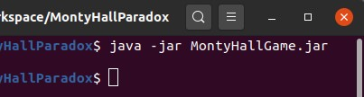
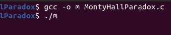

<html>
<header></header>
<body>
	Monty Hall Game
	  

	This game is about monty hall problem.
	You can read about it on <a href="https://en.wikipedia.org/wiki/Monty_Hall_problem">this</a> on link.
	  
	To run the game you need to install JavaSE Runtime  
	<a href="https://dl2.soft98.ir/soft/j-k-l/Java.SE.Runtime.Environment.8.0.261.x86.rar?1601924043">
	download 32bit for Windows</a> 
	<a href="https://dl2.soft98.ir/soft/j-k-l/Java.SE.Runtime.Environment.8.0.261.x64.rar?1601924043">
	download 64bit for Windows</a> 
	<a href="https://dl2.soft98.ir/soft/j-k-l/jre-8u261-linux-i586.tar.gz?1601924043">
	download 32bit for Linux</a> 
	<a href="https://dl2.soft98.ir/soft/j-k-l/jre-8u261-linux-x64.tar.gz?1601924043">
	download 64bit for Linux</a> 
	<a href="https://dl2.soft98.ir/soft/j-k-l/jre-8u261-macosx-x64.dmg?1601924043">
	download 64bit for mac</a> 
	 
	When you installed JavaSE Runtime, download the file "MonyHallGame.jar". 
	on Windows you can run it by double clicking on it.  
	on linux you can run by this command on terminal:  
	   
	
	You can also compile and run "MontyHallParadox.c" file by gcc. difference 
	between this file and the other is on the .c file, it starts 10000 tests and 
	chooses automatically.  
	  

</body>
</html>
